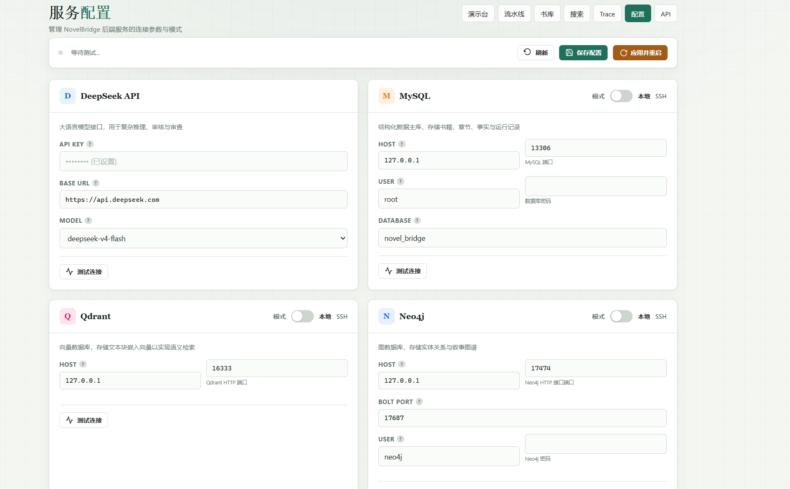
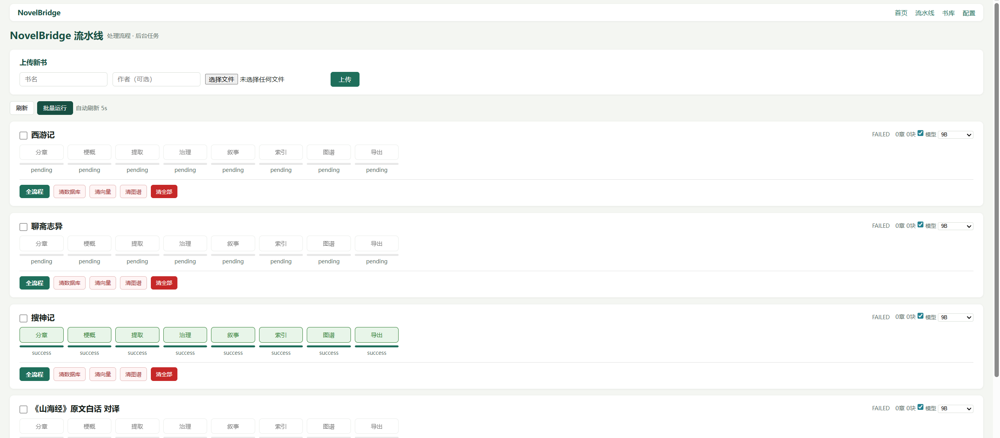
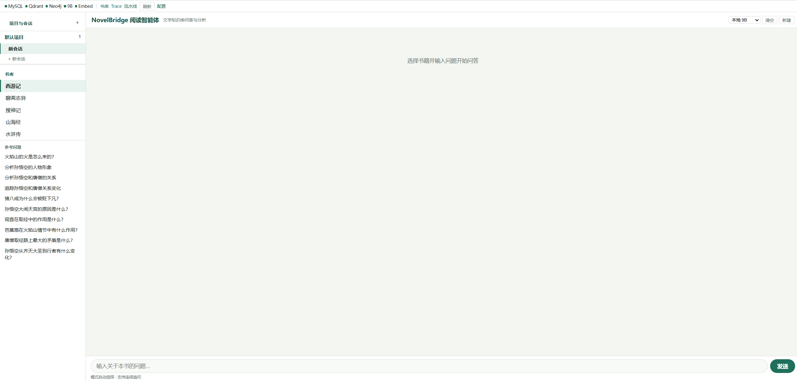

# NovelBridge

**中文 | [English](#english)**

---

<a id="chinese"></a>

## NovelBridge — 古典小说分析引擎

API-first 的古典小说阅读与写作分析工具。从原始文本到结构化知识库的全自动管线，支持混合检索 QA 和叙事图谱。

```
原始文本 → 分章 → 分块 → 实体/关系/事件提取
                               ↓
                          实体治理
                               ↓
                    ┌───────┼───────┐
                    ↓       ↓       ↓
               Qdrant 向量索引  QA 问答  Neo4j 图谱
```

> <!-- 架构图: 待补充 -->

---

### 快速开始

#### 环境要求

- Python 3.10+
- SSH 可访问远端服务器（运行 MySQL / Qdrant / Neo4j / llama-server / Embedding）
- 或本地运行所有服务

#### 1. 克隆项目

```bash
git clone https://github.com/yourusername/Novel-Bridge.git
cd Novel-Bridge
```

#### 2. 启动

```powershell
python manage_server.py start
```

自动完成：
1. 开 SSH 隧道到远端服务器（连接参数在 `/config` 页面配置）
2. 启动 uvicorn → `http://127.0.0.1:18079`

#### 3. 打开浏览器

```
http://127.0.0.1:18079/demo
```

#### 4. 配置服务

打开 **`http://127.0.0.1:18079/config`** 设置：

- **DeepSeek API Key** — 梗概生成 + 模型知识问答
- **MySQL / Qdrant / Neo4j / LLM / Embedding** — 连接参数
- **SSH 隧道** — 远端服务器地址和用户

每个服务卡片都支持 **Test Connection** 按钮验证连通性。

> <!-- SCREENSHOT: 配置页面 -->
>
> 

---

### 使用指南

#### 管线处理一本书

1. 打开 `/pipeline`
2. 上传 `.txt` 格式书籍
3. 点击单个阶段按钮或 **全流程** 一键运行 P1-P8

| 阶段 | 名称 | 功能 |
|------|------|------|
| P1 | 分章+分块 | 将原始文本拆分为章节和文本块 |
| P2 | 梗概 | 通过 DeepSeek API 生成书籍先验知识 |
| P3 | 提取 | 提取实体、关系、事件（模型或规则） |
| P4 | 治理 | 实体别名消歧和治理 |
| P5 | 叙事 | 构建叙事结构 |
| P6 | 索引 | 将文本块和事实索引到 Qdrant |
| P7 | 图谱 | 投影实体/关系到 Neo4j |
| P8 | 导出 | 导出训练数据 |

> <!-- SCREENSHOT: 管线运行页面 -->
>
> 

#### QA 问答

打开 `/demo`：

1. 左侧选择书籍
2. 输入问题或点击推荐问题
3. 获取带引用的答案

采用 **混合检索 RAG**（词法 + 稠密 + 结构化），检索无结果时自动回退到 DeepSeek 模型知识。

> <!-- SCREENSHOT: 问答演示页面 -->
>
> 

#### 浏览数据

- **`/browse`** — 书库总览
- **`/search`** — 跨书全文搜索
- **`/agent-runs`** — QA 追踪查看器

#### 内置书籍

| ID | 书名 |
|----|------|
| 6 | 西游记 |
| 7 | 聊斋志异 |
| 8 | 搜神记 |
| 9 | 山海经 |
| 10 | 水浒传 |

---

### 配置参考

通过 **`/config`** 页面（保存到 `novel_bridge_config.json`）。

| 服务 | 默认端口 | 说明 |
|------|---------|------|
| MySQL | 13306 | 结构化数据存储 |
| Qdrant | 16333 | 向量检索（1024 维） |
| Neo4j | 17474 / 17687 | 图谱投影 |
| llama-server | 18080 | 本地 9B 模型推理 |
| Embedding | 18082 | 文本向量化服务 |
| DeepSeek API | — | 云端 API（梗概 + 审核） |

---


### 部署

#### 本地开发 + 远端服务（SSH 隧道）

默认架构：Python 后端跑在本地，数据服务通过 SSH 隧道连接远端。

```powershell
python manage_server.py start     # 开隧道 + 起服务
python manage_server.py stop      # 关服务 + 关隧道
python manage_server.py status    # 查看状态
```

#### 远端服务器部署

远端只需运行标准服务，不需要 NovelBridge 代码：

```bash
# 在远端执行
cd deploy/remote
./nb_up.sh          # 启动所有 Docker 容器 + 原生进程
./nb_status.sh      # 查看状态
```

远端服务：MySQL / Qdrant / Neo4j / llama-server / Embedding，全部通过 Docker 或原生进程管理。

#### 环境变量

| 变量 | 默认值 | 说明 |
|------|--------|------|
| `NB_REMOTE_HOST` | `192.168.3.50` | SSH 隧道目标主机 |
| `NB_REMOTE_USER` | `wk` | SSH 隧道用户 |
| `MYSQL_PASSWORD` | — | MySQL 密码 |
| `NEO4J_PASSWORD` | — | Neo4j 密码 |
| `DEEPSEEK_API_KEY` | — | DeepSeek API 密钥 |

---

### 项目结构

```
Novel-Bridge/
├── apps/rag-agent/               # Python FastAPI 后端
│   ├── app/
│   │   ├── api/                  HTTP 路由
│   │   ├── pipeline/             P1-P8 管线处理
│   │   ├── qa/                   QA 引擎（混合检索）
│   │   ├── eval/                 评测系统
│   │   ├── quality/              质量工作流
│   │   ├── agent_runtime/        Agent 轨迹存储
│   │   ├── clients/              外部服务客户端
│   │   ├── stores/               数据访问层
│   │   └── static/               前端 HTML/CSS/JS
│   └── scripts/                  管理/运维脚本
├── deploy/remote/                Docker 部署配置
├── Novel-Bridge/                 Java Spring Boot（辅助）
├── docs/                         架构文档
├── schema.sql                    数据库表结构
└── manage_server.py              服务管理脚本
```

---

### 技术栈

| 组件 | 技术选型 |
|------|---------|
| 后端 | Python FastAPI |
| 前端 | Vanilla HTML/CSS/JS（无框架） |
| 数据库 | MySQL 8（utf8mb4） |
| 向量库 | Qdrant |
| 图谱库 | Neo4j（可选） |
| 本地模型 | llama-server（9B） |
| 向量模型 | Qwen3-Embedding-0.6B, 1024 维 |
| 云端模型 | DeepSeek API |
| RAG 策略 | 混合检索（词法 + 稠密 + 结构化） |

---

### License

**个人免费 / 商业需授权** — 详见 [LICENSE](LICENSE)。

```
个人使用、学习研究、开源贡献 → 免费
企业使用、商业产品、SaaS、内部系统 → 需购买商业授权
```

商业授权联系：**wukc20000501@163.com**

---

<a id="english"></a>

## NovelBridge — Classic Novel Analysis Engine

**English | [中文](#chinese)**

An **API-first novel reading and authoring analysis agent**. Automatic pipeline from raw text to structured knowledge base, with hybrid retrieval QA and narrative graph support.

```
Raw Text → Chapter Split → Chunking → Entity/Relation/Event Extraction
                                               ↓
                                       Entity Governance
                                               ↓
                                    ┌───────┼───────┐
                                    ↓       ↓       ↓
                              Qdrant Index  QA  Neo4j Graph
```

---

### Quick Start

#### Prerequisites

- Python 3.10+
- SSH access to a remote server running MySQL / Qdrant / Neo4j / llama-server / Embedding
- Or run all services locally

#### 1. Clone

```bash
git clone https://github.com/yourusername/Novel-Bridge.git
cd Novel-Bridge
```

#### 2. Start

```powershell
python manage_server.py start
```

This will:
1. Open SSH tunnel to remote server (configurable via `/config` page)
2. Start uvicorn → `http://127.0.0.1:18079`

#### 3. Open browser

```
http://127.0.0.1:18079/demo
```

#### 4. Configure services

Open **`http://127.0.0.1:18079/config`** to set up:

- **DeepSeek API Key** — for prior hints and model-based QA
- **MySQL / Qdrant / Neo4j / LLM / Embedding** — connection parameters
- **SSH Tunnel** — remote server address and credentials

Each card has a **Test Connection** button.


---

### Usage

#### Pipeline: Process a book

Open `/pipeline`, upload a `.txt` file, click a phase or **全流程** (full pipeline).

| Phase | Name | Function |
|-------|------|----------|
| P1 | Split+Chunk | Split raw text into chapters & chunks |
| P2 | Prior Hint | Generate prior hints via DeepSeek API |
| P3 | Extract | Extract entities, relations, events |
| P4 | Governance | Entity alias resolution |
| P5 | Narrative | Build narrative structure |
| P6 | Index | Index to Qdrant vector DB |
| P7 | Graph | Project to Neo4j |
| P8 | Export | Export training data |


#### QA: Ask questions

Open `/demo`, select a book, type a question. Answers include citations.

**Hybrid RAG** (lexical + dense + structured). Falls back to DeepSeek model knowledge when retrieval returns nothing.


#### Built-in Books

| ID | Title |
|----|-------|
| 6 | 西游记 (Journey to the West) |
| 7 | 聊斋志异 (Strange Tales) |
| 8 | 搜神记 (In Search of the Supernatural) |
| 9 | 山海经 (Classic of Mountains and Seas) |
| 10 | 水浒传 (Water Margin) |

---

### Deployment

#### Local + Remote (SSH Tunnel)

```powershell
python manage_server.py start     # SSH tunnel + uvicorn
python manage_server.py stop      # Stop both
python manage_server.py status    # Check status
```

#### Remote Server

No NovelBridge code needed on remote — only standard services:

```bash
cd deploy/remote
./nb_up.sh          # Start Docker + native services
```

| Service | Default Port |
|---------|-------------|
| MySQL | 13306 |
| Qdrant | 16333 |
| Neo4j | 17474 / 17687 |
| llama-server | 18080 |
| Embedding | 18082 |

#### Environment Variables

| Variable | Default | Description |
|----------|---------|-------------|
| `NB_REMOTE_HOST` | `192.168.3.50` | SSH tunnel host |
| `NB_REMOTE_USER` | `wk` | SSH tunnel user |
| `MYSQL_PASSWORD` | — | MySQL password |
| `NEO4J_PASSWORD` | — | Neo4j password |
| `DEEPSEEK_API_KEY` | — | DeepSeek API key |

---

### Project Structure

```
Novel-Bridge/
├── apps/rag-agent/               # Python FastAPI backend
│   ├── app/
│   │   ├── api/                  HTTP routes
│   │   ├── pipeline/             P1-P8 processing
│   │   ├── qa/                   QA engine (hybrid RAG)
│   │   ├── eval/                 Evaluation system
│   │   ├── quality/              Quality workflow
│   │   ├── agent_runtime/        Agent trace stores
│   │   ├── clients/              External service clients
│   │   ├── stores/               Data access layer
│   │   └── static/               Frontend HTML/CSS/JS
│   └── scripts/                  Admin scripts
├── deploy/remote/                Docker deployment
├── Novel-Bridge/                 Java Spring Boot (secondary)
├── docs/                         Architecture docs
├── schema.sql                    Database schema
└── manage_server.py              Server manager
```

---

### Technology Stack

| Component | Technology |
|-----------|-----------|
| Backend | Python FastAPI |
| Frontend | Vanilla HTML/CSS/JS |
| Database | MySQL 8 (utf8mb4) |
| Vector DB | Qdrant |
| Graph DB | Neo4j (optional) |
| Local LLM | llama-server (9B) |
| Embedding | Qwen3-Embedding-0.6B, 1024-dim |
| Cloud LLM | DeepSeek API |
| RAG | Hybrid (lexical + dense + structured) |

---

### License

**Free for personal use / Commercial license required** — See [LICENSE](LICENSE).

```
Personal use, education, research, open-source → Free
Commercial use, SaaS, internal business systems → Commercial license required
```

For commercial licensing: **wukc20000501@163.com**
